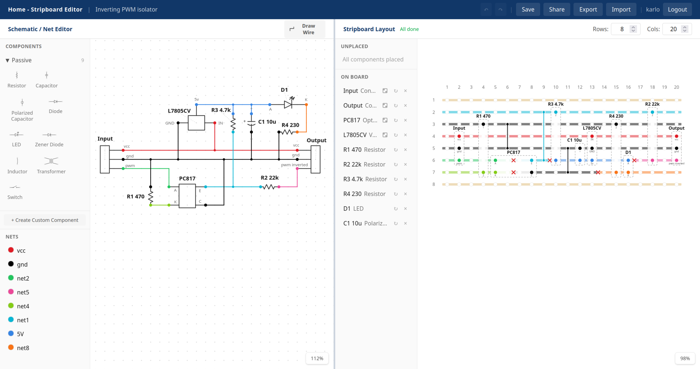

# Stripboard Editor

A web-based stripboard layout editor with a built-in schematic editor. Draw schematics with standard component symbols, wire up nets, and place components on a virtual stripboard with live strip colouring and conflict detection.

**Live at [stripboard-editor.com](https://stripboard-editor.com)**



## Tech Stack

- **Frontend**: Next.js 16 (App Router)
- **Backend**: Python Django, SQLite

## Local Development

### Frontend

```bash
cd src/frontend
```

```bash
npm install
```

```bash
cp .env.local.example .env.local
```

```bash
npm run dev
```

### Backend

```bash
cd src/backend
```

```bash
python -m venv venv
```

```bash
source venv/bin/activate
```

```bash
pip install -r requirements.txt
```

```bash
cp .env.example .env
```

```bash
python manage.py migrate
```

```bash
python manage.py runserver 0.0.0.0:8000
```

### Create an Admin User

```bash
cd src/backend
```

```bash
source venv/bin/activate
```

```bash
python manage.py create_dev_admin --username admin --password admin
```

This creates a superuser that works with both the Django admin panel (`/admin/`) and the frontend login. The password is SHA-256 pre-hashed to match the frontend's login flow.

### Both running

Frontend at `http://localhost:3000`, backend API at `http://localhost:8000/api/`.