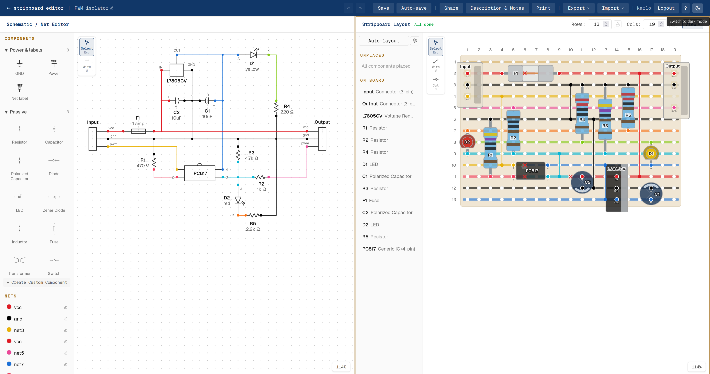
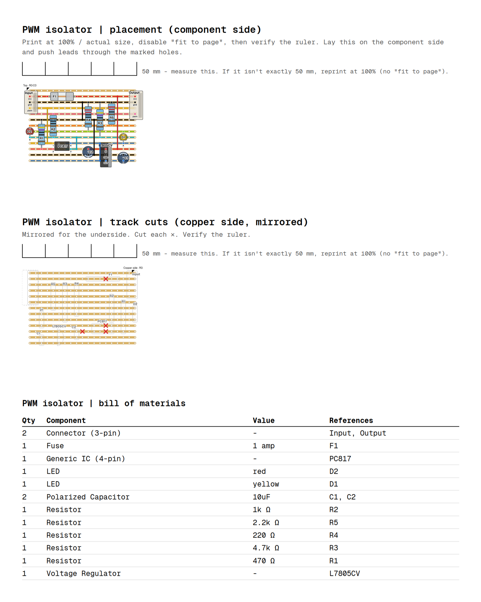

# Stripboard Editor

A free, web-based stripboard (veroboard) layout editor with a built-in schematic editor. Draw a schematic, place the parts onto a virtual board, and the copper strips take the colour of your nets with live conflict detection and an overview of what still needs to be connected. When the layout is done, print a true-scale template and build it.

**Live at [stripboard-editor.com](https://stripboard-editor.com?utm_source=github)** · free forever · account optional · no ads

<picture>
  <source media="(prefers-color-scheme: dark)" srcset="src/frontend/public/demo-circuit-dark.png">
  
</picture>

## What it does

1. **Draw the schematic.** Place components from the symbol library or create your own, and wire up the pins to define your nets.
2. **Drop onto the board.** Drag parts onto the stripboard; strips colour-code to your nets automatically.
3. **Resolve conflicts.** Add cuts and link wires; anything wrong lights up red the moment it happens.
4. **Print and build.** Print a 1:1 template with a mirrored copper-side cut guide and a bill of materials (BOM), lay it on the board, and push parts straight through the paper.



An account is optional: you can create and edit projects without signing up, just keep the project's URL to come back to it later. Logging in keeps all your projects in one place and lets you share a design as a read-only or an editable link.

## Feedback

This is a fairly new project and still actively developed, with features added regularly. Ideas, bug reports, and questions are genuinely appreciated:

- Leave a message right in the app at [stripboard-editor.com/feedback](https://stripboard-editor.com/feedback?utm_source=github)
- Or open a [GitHub issue](https://github.com/KarloFunke/stripboard-editor/issues)

You can also follow [what's new and what's planned](https://stripboard-editor.com/updates?utm_source=github).

## Tech Stack

- **Frontend**: Next.js
- **Backend**: Python Django, SQLite

## Local Development

Frontend runs at `http://localhost:3000`, backend API at `http://localhost:8000/api/`.

### Frontend

```bash
cd src/frontend
npm install
cp .env.local.example .env.local
npm run dev
```

### Backend

```bash
cd src/backend
python -m venv venv
source venv/bin/activate
pip install -r requirements.txt
cp .env.example .env
python manage.py migrate
python manage.py runserver 0.0.0.0:8000
```

### Create an admin user

```bash
cd src/backend
source venv/bin/activate
python manage.py create_dev_admin --username admin --password admin
```

This creates a superuser that works with both the Django admin panel (`/admin/`) and the frontend login.
